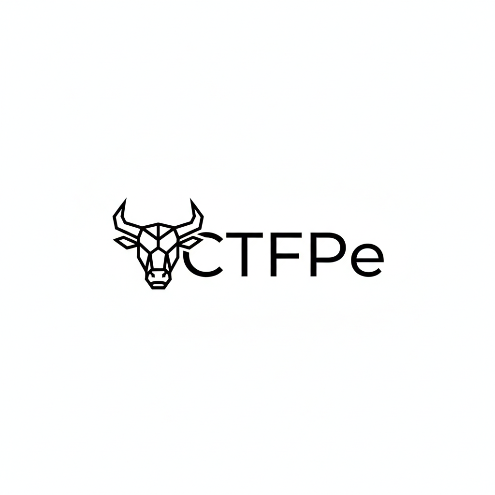

# ctfPe

**CTFPe** is an educational, JavaScript-based Capture The Flag (CTF) platform built for learning and study purposes. Currently for development use only, this project is designed to host CTF challenges and enhance security knowledge.

